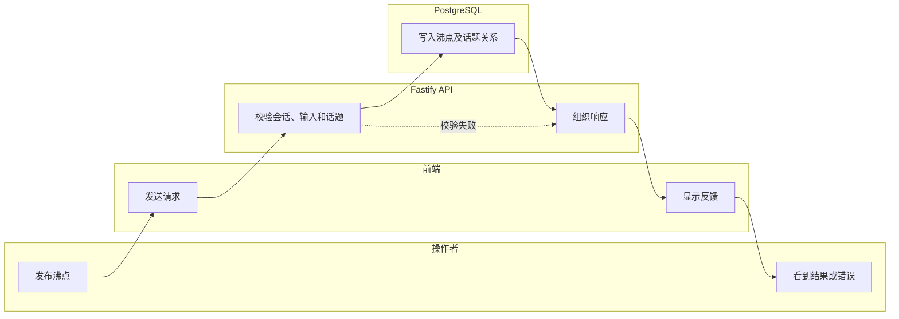
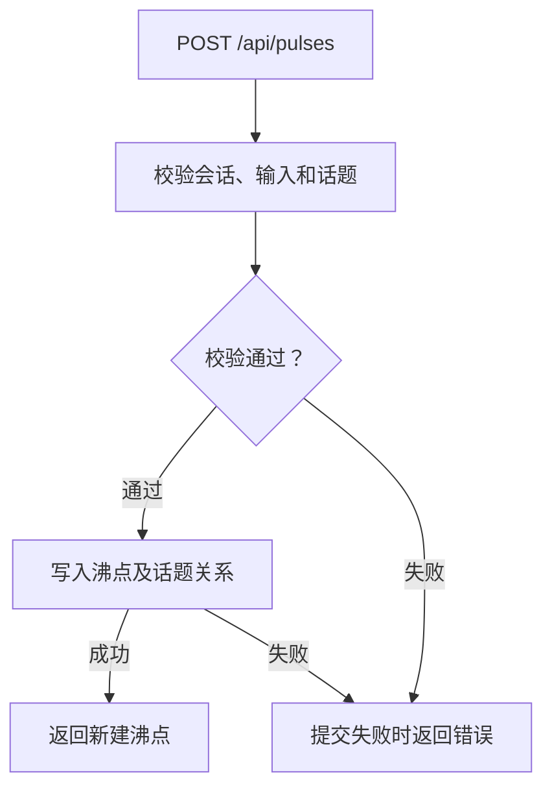
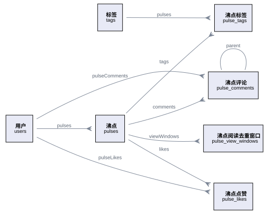

# 沸点设计图

[模块图册](./README.md) · [模块设计](../../1.2/pulses.md) · [服务端路由](../../../apps/api/features/pulses/pulses.ts)

## 泳道图

```mermaid
flowchart LR
    subgraph actor["操作者"]
        direction TB
        start["发布沸点"]
        outcome["看到结果或错误"]
    end
    subgraph web["前端"]
        direction TB
        send["发送请求"]
        feedback["显示反馈"]
    end
    subgraph api["Fastify API"]
        direction TB
        guard["校验会话、输入和话题"]
        result["组织响应"]
    end
    subgraph storage["PostgreSQL"]
        direction TB
        query["写入沸点及话题关系"]
    end
    start --> send --> guard --> query --> result --> feedback --> outcome
    guard -. 校验失败 .-> result
```

## 业务流程图

```mermaid
flowchart TD
    A["POST /api/pulses"] --> B["校验会话、输入和话题"]
    B --> C{"校验通过？"}
    C -->|通过| D["写入沸点及话题关系"]
    D -->|成功| E["返回新建沸点"]
    C -->|失败| F["提交失败时返回错误"]
    D -->|失败| F
```

## 数据表设计图

[打开双语表关系 SVG](./pulses.svg)

